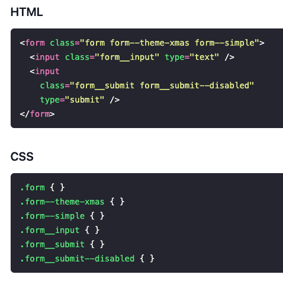
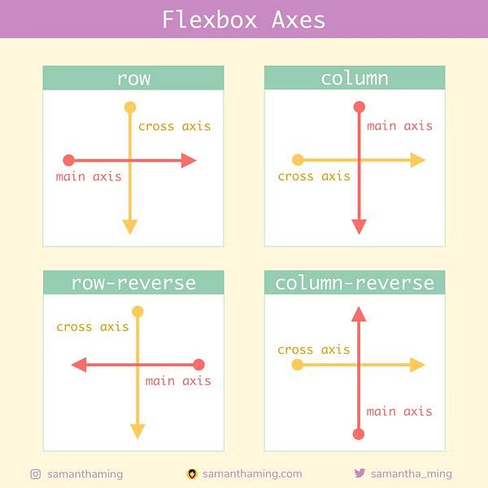

# Day 2

## Morning

- [What is HTML](https://www.w3schools.com/html/html_intro.asp)
  - [The Document Object Model](https://www.w3schools.com/whatis/whatis_htmldom.asp)
  - [HTML Elements](https://www.w3schools.com/html/html_elements.asp)
  - [Semantic Elements](https://www.w3schools.com/html/html5_semantic_elements.asp)
- [The Box Model](https://www.w3schools.com/css/css_boxmodel.asp)
- [CSS Syntax](https://www.w3schools.com/css/css_syntax.asp)
- [CSS Selectors](https://www.w3schools.com/cssref/css_selectors.php)
  - Pseudo-selectors
  - Pseudo-classes
  - Wildcard Selector
  - Specificity
  - [Emmet Abbreviations](https://docs.emmet.io/abbreviations/)
  - [Block\_\_Element--Modifier Naming](https://getbem.com/naming/)
- [Positioning](https://developer.mozilla.org/en-US/docs/Web/CSS/position)
- [Displays](https://www.w3schools.com/cssref/pr_class_display.php)

 

## Afternoon

- [Figma -- Laying out our ideas](https://www.figma.com)
- Flexbox
- Code along

 

# Visuals

